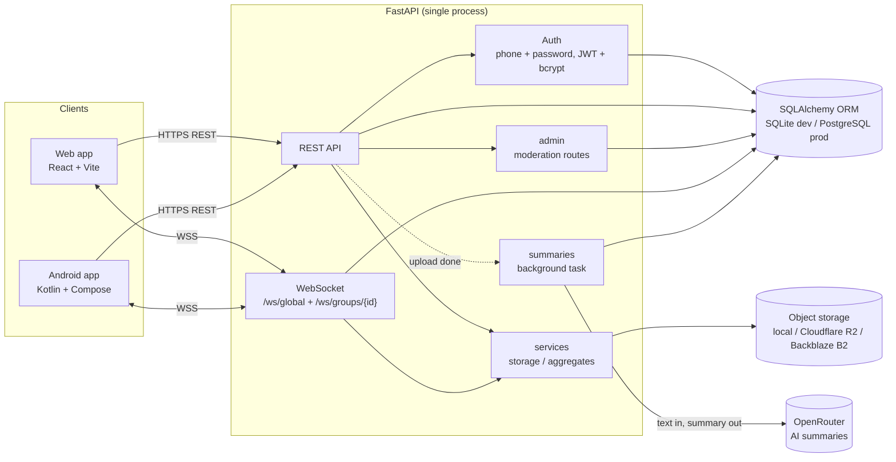

# Diagrams

Sources: [architecture.mmd](architecture.mmd), [dataflow.mmd](dataflow.mmd).

## System architecture



## Data flow

```mermaid
flowchart TD
    C[Client action] --> R{Transport}
    R -->|CRUD, history, auth| REST[REST request]
    R -->|live chat| WS[WebSocket frame]

    REST --> V[Pydantic validation] --> H[Handler] --> Q[(Database)]
    WS --> H2[Socket handler] --> Q
    H2 --> F["Fan-out to the room's sockets<br/>(global room or one group)"] --> C

    U[User uploads PDF or image] -->|multipart| REST2["POST /notes/{id}/attachments"]
    REST2 --> S[storage service] --> OS[(local disk / R2 / B2)]
    REST2 --> M[(DB row: key + metadata + summary_status=pending)]
    M --> BG[Background task: extract text]
    BG -->|OPENROUTER_API_KEY set| LLM[OpenRouter chat completion]
    LLM --> R1[(summary_status=ready)]
    BG -->|no key or not a PDF| R2[(summary_status=skipped)]
    BG -->|extraction or API error| R3[(summary_status=failed)]
    R1 --> P[Client polls GET /notes/{id}/attachments] --> C
    R2 --> P
    R3 --> P
```
